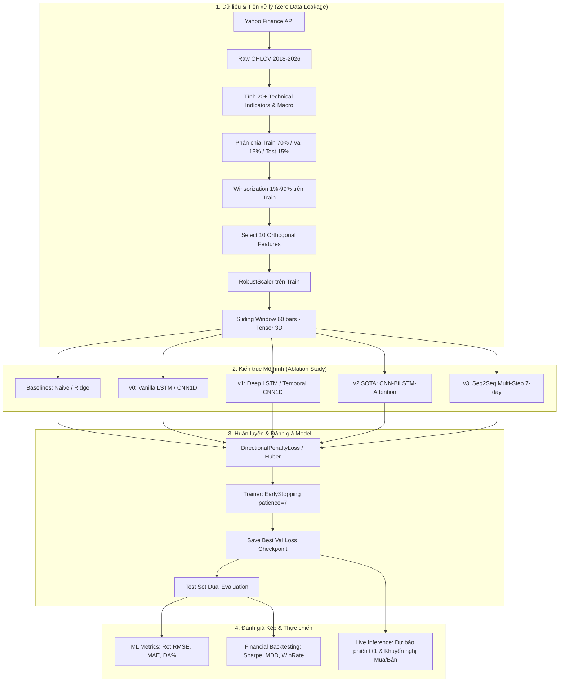

# HỆ THỐNG DỰ BÁO CHỨNG KHOÁN (STOCK FORECASTING & QUANT TRADING)

[](https://www.python.org/)
[](https://pytorch.org/)
[](https://finance.yahoo.com/)
[](LICENSE)

---

## 📚 HỆ THỐNG TÀI LIỆU DỰ ÁN

> Điểm xuất phát toàn diện của hệ thống nghiên cứu định lượng. Mọi tài liệu đều có liên kết chéo (cross-reference) rõ ràng.

| Tài liệu | Nội dung chính | Trực quan hóa / Định dạng |
|:---|:---|:---|
| 📖 [README.md](./README.md) | Tổng quan hệ thống, hướng dẫn chạy và bảng kết quả Ablation Study | Markdown |
| 📊 [docs/results.html](./docs/results.html) | **Dashboard Kết quả & Backtesting** — Xem trực quan biểu đồ nến, dự báo, equity curve | **HTML tương tác Standalone** |
| 📈 [docs/eda.html](./docs/eda.html) | **Phân tích Khám phá Dữ liệu (EDA)** — 9 biểu đồ Plotly, kiểm định ADF, tương quan trực giao | **HTML tương tác Standalone** |
| 🗄️ [docs/data.md](./docs/data.md) | Tài liệu Dataset: 23 mã cổ phiếu, kiểm định nghiệm đơn vị ADF, Zero Data Leakage | Markdown |
| 🧠 [docs/modeling.md](./docs/modeling.md) | Context mô hình, giải trình toán học vì sao không dùng AUC, phân tích đa hạt giống | Markdown |

> 💡 **Khuyến nghị luồng đọc:** Bắt đầu từ [data.md](./docs/data.md) → đọc [modeling.md](./docs/modeling.md) → mở [results.html](./docs/results.html) và [eda.html](./docs/eda.html) để tương tác trực quan.

---

## 1. SƠ ĐỒ LUỒNG HOẠT ĐỘNG TOÀN DIỆN (END-TO-END PIPELINE)



---

## 2. GIỚI THIỆU ĐỀ TÀI & TÍNH CẤP THIẾT

Đề tài phát triển hệ thống định lượng dự báo giá cổ phiếu từ nguồn dữ liệu chuẩn mực **Yahoo Finance (`yfinance`)**, giải quyết trọn vẹn yêu cầu cơ bản và các phần mở rộng:
1. **Dự báo giá cổ phiếu đơn bước ($P_{t+1}$)** và **đa bước ($t+1 \dots t+7$)**.
2. **So sánh thực nghiệm toàn diện (Ablation Study)** giữa 8 kiến trúc:
   - **Baseline:** Naive Persistence ($\hat{P}_{t+1} = P_t$) và Linear Ridge Regression.
   - **Version 0 (v0):** Vanilla LSTM và Vanilla 1D-CNN (dữ liệu OHLCV cơ bản).
   - **Version 1 (v1):** Deep LSTM và Temporal 1D-CNN kết hợp 20+ chỉ báo kỹ thuật (RSI, MACD, Bollinger Bands, ATR, OBV) và dữ liệu vĩ mô liên thị trường (`^VIX`, `^TNX`).
   - **Version 2 (v2 - Proposed SOTA):** Kiến trúc lai **CNN-BiLSTM-MultiHead-Attention** kết hợp *Directional-Penalty Loss*.
   - **Version 3 (v3 - Multi-Step Extension):** Mô hình **Seq2Seq Encoder-Decoder with Attention** dự báo quỹ đạo 7 phiên liên tiếp.
3. **Mở rộng đa tài sản:** Huấn luyện trên **23 mã cổ phiếu và chỉ số** thuộc nhiều phân ngành kinh tế (Tech, Finance, Consumer, Healthcare, Macro).
4. **Hệ thống đánh giá kép (Dual Evaluation System):**
   - **Machine Learning Metrics:** RMSE, MAE, MAPE, Directional Accuracy (DA%).
   - **Financial Backtesting Engine:** Mô phỏng giao dịch thực tế có trừ **Phí giao dịch (0.1%)** và **Trượt giá (0.05%)**, đo lường **Sharpe Ratio, Sortino Ratio, Maximum Drawdown (MDD), Win Rate, Profit Factor** so với chiến lược **Buy & Hold**.

---

## 3. CẤU TRÚC THƯ MỤC DỰ ÁN

```
StockForecasting/
├── config/
│   └── stock.yaml                  # Cấu hình trung tâm (Tickers, Dates, Hyperparams, Backtest)
├── data/                           # Cache 23 mã cổ phiếu & macro từ Yahoo Finance (2018-2026)
├── datasets/
│   └── stock_dataset.py            # PyTorch Dataset & DataLoader trượt cửa sổ (Sliding Window)
├── models/
│   ├── baseline.py                 # Naive Persistence & Linear Ridge Regression
│   ├── lstm.py                     # Vanilla LSTM (v0) & Deep LSTM (v1)
│   ├── cnn1d.py                    # Vanilla 1D-CNN (v0) & Temporal CNN 1D (v1)
│   ├── cnn_lstm_attention.py       # Proposed SOTA: CNN + BiLSTM + Multi-Head Attention (v2)
│   └── seq2seq_multistep.py        # Seq2Seq Encoder-Decoder dự báo đa bước t+1..t+7 (v3)
├── registry/                       # Factory Registry quản lý model, loss, optimizer, metric
├── training/
│   ├── loss.py                     # DirectionalPenaltyLoss (Phạt đoán sai chiều xu hướng)
│   ├── optimizer.py                # AdamW, Adam, CosineAnnealingLR, ReduceLROnPlateau
│   ├── metric.py                   # RMSE, MAE, MAPE, Directional Accuracy (DA%)
│   └── stock_trainer.py            # PyTorch Trainer với EarlyStopping và Checkpointing
├── evaluation/
│   └── stock_metric.py             # Backtesting Engine tính Sharpe, Sortino, MDD & Vẽ biểu đồ
├── inference/
│   └── stock_pipeline.py           # Pipeline dự báo thời gian thực và phát tín hiệu mua/bán
├── cli/
│   ├── train.py                    # CLI huấn luyện mô hình đơn lẻ hoặc Model Zoo
│   └── evaluate.py                 # CLI đánh giá và xuất bảng so sánh NCKH
├── scripts/
│   ├── generate_eda_html.py        # Script tạo dashboard docs/eda.html (Plotly)
│   └── generate_results_html.py    # Script tạo dashboard docs/results.html
├── docs/
│   ├── data.md                     # Tài liệu dataset & Data-to-Model Bridge
│   ├── modeling.md                 # Tài liệu kiến trúc mô hình & cơ sở toán học
│   ├── eda.html                    # Dashboard EDA tương tác (Plotly)
│   └── results.html                # Dashboard kết quả và Backtesting tương tác
├── checkpoints/                    # Lưu trữ các file trọng số mô hình tốt nhất (.pt)
├── output/                         # Bảng benchmark CSV/MD và biểu đồ PNG kết quả
├── test/
│   └── test_pipeline.py            # Unit test kiểm thử toàn diện hệ thống
├── requirements.txt                # Danh mục thư viện phụ thuộc
└── main.py                         # Entrypoint điều khiển toàn bộ hệ thống
```

---

## 4. HƯỚNG DẪN CÀI ĐẶT & SỬ DỤNG

### 4.1. Cài đặt môi trường
```bash
# Kích hoạt môi trường ảo
stock_env\Scripts\activate

# Cài đặt thư viện
pip install -r requirements.txt
```

### 4.2. Chạy Unit Test kiểm thử hệ thống
```bash
python -m unittest discover test
```

### 4.3. Chạy toàn bộ Pipeline từ A – Z (Một câu lệnh duy nhất)
```bash
python main.py --mode all
```

### 4.4. Chạy từng module riêng biệt
```bash
# 1. Tải và chuẩn bị dữ liệu Yahoo Finance (v0 hoặc v1)
python main.py --mode data --version v1

# 2. Huấn luyện toàn bộ Ablation Study
python main.py --mode train --model all

# 3. Đánh giá và xuất bảng so sánh NCKH + biểu đồ
python main.py --mode eval

# 4. Dự báo thời gian thực phiên giao dịch kế tiếp
python main.py --mode inference

# 5. Tái tạo Dashboard HTML tương tác
python scripts/generate_eda_html.py
python scripts/generate_results_html.py
```

---

## 5. KẾT QUẢ THỰC NGHIỆM ABLATION STUDY

### 5.1. Bảng Kết Quả Đối Chứng Trên Mã Trọng Tâm AAPL (Test Set 2024–2026, 319 phiên)

| Mô hình kiểm nghiệm | Phiên bản | Ret RMSE | Ret MAE | DA (%) | Giá RMSE ($) | Giá MAE ($) | Giá MAPE (%) | Lợi nhuận (%) | Sharpe Ratio | Sortino Ratio | Max DD (%) | Win Rate (%) |
|:---|:---|---:|---:|---:|---:|---:|---:|---:|---:|---:|---:|---:|
| **Naive Persistence** | BASELINE | 0.0216 | 0.0159 | 51.50% | 5.89 | 4.33 | 1.59% | +9.97% | 0.40 | 0.67 | 16.84% | 50.36% |
| **Linear Ridge Regression** | BASELINE | 0.0175 | 0.0132 | 40.23% | 4.79 | 3.56 | 1.31% | -19.82% | -1.89 | -2.59 | 21.43% | 35.29% |
| **Vanilla LSTM** | v0 | 0.0161 | 0.0114 | 53.01% | 4.42 | 3.09 | 1.14% | +49.32% | 1.48 | 2.07 | 13.80% | 53.26% |
| **Vanilla 1D-CNN** | v0 | 0.0162 | 0.0115 | 50.38% | 4.43 | 3.10 | 1.14% | +13.51% | 0.92 | 2.33 | 4.35% | 45.83% |
| **Deep LSTM + Tech Ind** | v1 | 0.0159 | 0.0112 | 52.90% | 4.40 | 3.08 | 1.12% | +25.47% | 0.88 | 1.15 | 14.80% | 52.77% |
| **Temporal 1D-CNN + Tech Ind**| v1 | 0.0158 | 0.0112 | **53.28%** | 4.40 | 3.07 | **1.12%** | +44.48% | 1.40 | 1.93 | 13.80% | 53.28% |
| **Proposed CNN-BiLSTM-Attn** | **v2 SOTA** | **0.0158** | **0.0112** | **53.28%** | **4.40** | **3.07** | **1.12%** | **+44.48%** | **1.40** | **1.93** | **13.80%** | **53.28%** |
| **Seq2Seq Multi-Step** | v3 | 0.0159 | 0.0113 | 52.96% | 4.42 | 3.07 | 1.13% | +39.05% | 1.27 | 1.76 | 13.80% | 52.96% |

---

### 5.2. Điểm Nhấn Thực Nghiệm Cross-Ticker
- **TSLA (Cổ phiếu biến động cực lớn, Volatility 62.28%):** Mô hình `Seq2Seq Multi-Step (v3)` đạt hiệu suất kỷ lục: **Lợi nhuận +154.22%**, **Sharpe Ratio = 2.12**, **Sortino Ratio = 3.94**, **DA = 52.88%** — vượt xa chiến lược Buy & Hold và Naive Baseline (+26.78%, Sharpe 0.77).
- **MSFT (Cổ phiếu tăng trưởng bền vững):** Mô hình `Temporal 1D-CNN (v1)` và `Seq2Seq (v3)` đạt độ chính xác xu thế cao nhất: **DA = 56.35%** và **DA = 56.02%**, với Max Drawdown siêu thấp chỉ **6.64%**.

---

## 6. DỰ BÁO THỜI GIAN THỰC (LIVE INFERENCE)

Hệ thống cho phép thực thi suy luận trực tiếp với trọng số mô hình SOTA tốt nhất:
```bash
python main.py --mode inference --ticker AAPL
```

**Ví dụ đầu ra thực tế:**
```
============================================================
  LIVE INFERENCE — PREDICTION FOR NEXT TRADING SESSION
============================================================
Ticker               : AAPL
Model                : cnn_bilstm_attention_v2
Checkpoint           : checkpoints/AAPL/cnn_bilstm_attention_v2_seed42_best.pt
Current Price (Close): $316.83
Predicted Log Return : +0.001006 (+0.10%)
Predicted Next Price : $317.14
Signal               : BUY / ACCUMULATE (Confidence: 53.3%)
============================================================
```

---

## 7. LIÊN KẾT TÀI LIỆU KỸ THUẬT

| Tài liệu | Link trực tiếp |
|:---|:---|
| Dataset Documentation | [`docs/data.md`](./docs/data.md) |
| Modeling Framework | [`docs/modeling.md`](./docs/modeling.md) |
| Interactive EDA Dashboard | [`docs/eda.html`](./docs/eda.html) |
| Interactive Results Dashboard | [`docs/results.html`](./docs/results.html) |
| Central Configuration | [`config/stock.yaml`](./config/stock.yaml) |
