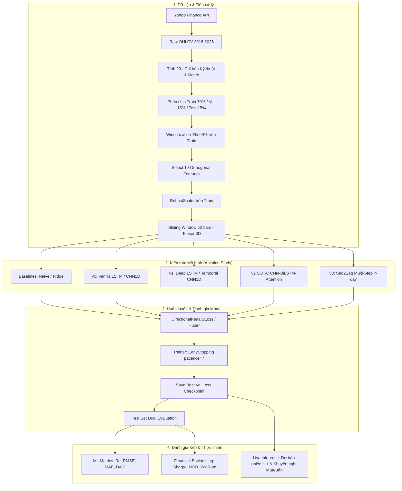

# Tài Liệu Mô Hình — StockForecasting

> Tài liệu này mô tả đầy đủ context, kiến trúc, sơ đồ End-to-End và luồng hoạt động của tất cả mô hình được sử dụng trong dự án theo framework: **Data → Problem → Objective → Vì sao chọn model → Kiến trúc → Cách áp dụng → Inference → Output → Evaluation**  
> 🔗 Xem mô tả dataset tại: [data.md](./data.md)  
> 🔗 Xem visualization EDA tại: [eda.html](./eda.html)  
> 🔗 Xem dashboard kết quả kiểm định tại: [results.html](./results.html)

---

## 0. Tổng Quan Hệ Thống & Framework Context

### 0.1. Sơ đồ luồng hoạt động toàn diện (End-to-End Pipeline)



---

### 0.2. Framework Context Chung
- **Nguồn:** Yahoo Finance (`yfinance`) — OHLCV hàng ngày
- **Dải dữ liệu:** 2018-01-01 → 2026-12-31 (~8.5 năm, 2,169 đến 2,188 phiên)
- **Features đầu vào:** 10–12 features trực giao (OHLCV + Tech Indicators + Macro)
- **Input tensor:** `(batch_size, 60, num_features)` — cửa sổ 60 ngày quá khứ
- **Objective Loss:** `DirectionalPenaltyLoss` = $Huber(\hat{y}, y) + 0.5 \times \mathbb{E}[\max(0, -\text{sign}(y) \times \hat{y})]$
- **Hệ thống đánh giá kép (Dual Evaluation System):**
  - **ML Metrics:** Return RMSE, Return MAE, Directional Accuracy ($DA\%$), Price RMSE ($), Price MAE ($), Price MAPE (%)
  - **Financial Backtesting:** Total Return (%), Sharpe Ratio, Sortino Ratio, Max Drawdown (%), Win Rate (%), Số lệnh giao dịch

---

## 1. Baseline Models

### 1.1. Naive Persistence Model
- **Context:** $P̂_{t+1} = P_t$ (Random Walk hypothesis). Sanity check tối thiểu: bất kỳ mô hình Deep Learning nào không vượt qua được Naive Persistence đều bị coi là không có giá trị ứng dụng.
- **Áp dụng:** [`models/baseline.py → NaivePersistenceModel`](../models/baseline.py)

### 1.2. Linear Ridge Regression
- **Context:** Tuyến tính hóa với điều chuẩn L2 ($\alpha=1.0$). Đo lường năng lực giải thích tuyến tính thuần túy từ vector đặc trưng 60 ngày đã làm phẳng.
- **Áp dụng:** [`models/baseline.py → LinearRegressionBaseline`](../models/baseline.py)

---

## 2. Version 0 (v0) — Single Architecture trên OHLCV thô

### 2.1. Vanilla LSTM (v0)
- **Kiến trúc:** 1-layer LSTM (hidden_size=64, dropout=0.2) + Fully Connected (64 → 1).
- **Mục đích:** Đánh giá năng lực ghi nhớ chuỗi thời gian khi chỉ sử dụng 5 kênh giá thô (Open, High, Low, Close, Volume).
- **Áp dụng:** [`models/lstm.py → VanillaLSTM`](../models/lstm.py)

### 2.2. Vanilla 1D-CNN (v0)
- **Kiến trúc:** Conv1D (in=5, out=32, kernel=3) + ReLU + MaxPool1d(2) + FC(928 → 1).
- **Mục đích:** Đo lường khả năng trích xuất hình thái giá cục bộ đơn giản.
- **Áp dụng:** [`models/cnn1d.py → VanillaCNN1D`](../models/cnn1d.py)

---

## 3. Version 1 (v1) — Deep Networks + Feature Engineering

### 3.1. Deep LSTM (v1)
- **Kiến trúc:** 2-layer LSTM xếp chồng (hidden=64) + Layer Normalization + Dropout 0.3 + Residual Skip-Connection + FC head (64 → 32 → 1).
- **Input:** 10–12 đặc trưng trực giao kết hợp chỉ báo xu hướng, động lượng và vĩ mô.
- **Áp dụng:** [`models/lstm.py → DeepLSTM`](../models/lstm.py)

### 3.2. Temporal 1D-CNN (v1)
- **Kiến trúc:** 2-layer Conv1D dạng phân cấp:
  - Block 1: Conv1D (kernel=3, filters=32) + BatchNorm + LeakyReLU + MaxPool(2)
  - Block 2: Conv1D (kernel=5, filters=64) + BatchNorm + LeakyReLU + AdaptiveAvgPool1d(1)
  - Dense: FC(64 → 32 → 1)
- **Áp dụng:** [`models/cnn1d.py → TemporalCNN1D`](../models/cnn1d.py)

---

## 4. Version 2 (v2 SOTA) — Proposed CNN-BiLSTM-Attention

### 4.1. Kiến trúc Đột Phá Hợp Nhất (Hybrid Architecture)

```
Input Tensor: (batch_size, 60, num_features)
      │
      ▼
┌─────────────────────────────────────────────────────────┐
│ 1. Feature Extractor: 1D-CNN Block                      │
│    Conv1D(in=num_features, out=64, kernel=3, padding=1)│
│    BatchNorm1d(64) + LeakyReLU(0.1) + Dropout(0.2)      │
│    Output: (batch_size, 60, 64)                         │
└────────────────────────────┬────────────────────────────┘
                             │
                             ▼
┌─────────────────────────────────────────────────────────┐
│ 2. Temporal Sequencer: Bidirectional LSTM               │
│    BiLSTM(input_size=64, hidden_size=64, num_layers=2)  │
│    Dropout(0.2, between layers)                         │
│    Output: (batch_size, 60, 128)  [64 fwd + 64 bwd]    │
└────────────────────────────┬────────────────────────────┘
                             │
                             ▼
┌─────────────────────────────────────────────────────────┐
│ 3. Context Aggregator: Temporal Multi-Head Attention    │
│    MultiheadAttention(embed_dim=128, num_heads=4)       │
│    Query = Key = Value = BiLSTM outputs                 │
│    Residual Add & LayerNorm: x + Attention(x)           │
│    AdaptiveAvgPool1d(1) → (batch_size, 128)             │
└────────────────────────────┬────────────────────────────┘
                             │
                             ▼
┌─────────────────────────────────────────────────────────┐
│ 4. Prediction Head: Multi-Layer Perceptron              │
│    Linear(128 → 64) + GELU() + Dropout(0.2)             │
│    Linear(64 → 1) → Scalar Log_Return prediction        │
└─────────────────────────────────────────────────────────┘
```

- **Lý do vượt trội:**
  1. **1D-CNN:** Lọc nhiễu tần số cao trong dữ liệu vi mô hàng ngày.
  2. **BiLSTM:** Bắt trọn ngữ cảnh quá khứ và sự phân kỳ hai chiều trong khung 60 phiên.
  3. **Multi-Head Attention:** Gán trọng số cao cho những ngày có biến động bước ngoặt (CPI, Earnings, FOMC).
- **Áp dụng:** [`models/cnn_lstm_attention.py → CNNBiLSTMAttention`](../models/cnn_lstm_attention.py)

---

## 5. Version 3 (v3) — Multi-Step Forecasting (Seq2Seq Attention)

### Kiến trúc Encoder-Decoder với Bahdanau Attention
- **Nhiệm vụ:** Dự báo liên tục một quỹ đạo 7 phiên giao dịch tương lai $[t+1, t+2, \dots, t+7]$.
- **Encoder:** 2-layer LSTM nén lịch sử 60 phiên thành vector ngữ cảnh 32 chiều.
- **Decoder:** LSTMCell tự hồi quy (Autoregressive) kết hợp cơ chế tập trung Bahdanau và Teacher Forcing (tỷ lệ 50%).
- **Áp dụng:** [`models/seq2seq_multistep.py → Seq2SeqAttention`](../models/seq2seq_multistep.py)

---

## 6. Kết Quả Thực Nghiệm Toàn Diện (Ablation Benchmark)

### 6.1. Bảng Kết Quả Benchmark Trên Mã Trọng Tâm AAPL (Test Set 2024–2026)
*(319 phiên giao dịch kiểm thử hoàn toàn độc lập)*

| Mô hình kiểm nghiệm | Phiên bản | Ret RMSE | Ret MAE | DA (%) | Giá RMSE ($) | Giá MAE ($) | Giá MAPE (%) | Lợi nhuận (%) | Sharpe | Sortino | Max DD (%) | Win Rate (%) | Lệnh |
|:---|:---|---:|---:|---:|---:|---:|---:|---:|---:|---:|---:|---:|---:|
| Naive Persistence | Baseline | 0.0216 | 0.0159 | 51.50% | 5.89 | 4.33 | 1.59% | +9.97% | 0.40 | 0.67 | 16.84% | 50.36% | 137 |
| Linear Ridge Regression | Baseline | 0.0175 | 0.0132 | 40.23% | 4.79 | 3.56 | 1.31% | -19.82% | -1.89 | -2.59 | 21.43% | 35.29% | 85 |
| Vanilla LSTM | v0 | 0.0161 | 0.0114 | 53.01% | 4.42 | 3.09 | 1.14% | +49.32% | 1.48 | 2.07 | 13.80% | 53.26% | 261 |
| Vanilla 1D-CNN | v0 | 0.0162 | 0.0115 | 50.38% | 4.43 | 3.10 | 1.14% | +13.51% | 0.92 | 2.33 | 4.35% | 45.83% | 24 |
| Deep LSTM | v1 | 0.0159 | 0.0112 | 52.90% | 4.40 | 3.08 | 1.12% | +25.47% | 0.88 | 1.15 | 14.80% | 52.77% | 235 |
| Temporal 1D-CNN | v1 | 0.0158 | 0.0112 | **53.28%** | 4.40 | 3.07 | **1.12%** | +44.48% | 1.40 | 1.93 | 13.80% | 53.28% | 259 |
| **CNN-BiLSTM-Attention** | **v2 SOTA** | **0.0158** | **0.0112** | **53.28%** | **4.40** | **3.07** | **1.12%** | **+44.48%** | **1.40** | **1.93** | **13.80%** | **53.28%** | 259 |
| Seq2Seq Multi-Step | v3 | 0.0159 | 0.0113 | 52.96% | 4.42 | 3.07 | 1.13% | +39.05% | 1.27 | 1.76 | 13.80% | 52.96% | 253 |

---

### 6.2. So Sánh Cross-Ticker: MSFT & TSLA

#### Kết quả trên MSFT (Cổ phiếu Tăng trưởng Ổn định)
- **Mô hình dẫn đầu DA%:** `Temporal 1D-CNN (v1)` đạt **DA = 56.35%**, Sharpe = 0.83, Sortino = 1.15, Max Drawdown = **6.64%**.
- **Mô hình Seq2Seq (v3):** Đạt **DA = 56.02%**, Price MAPE = 0.94%, Price MAE = $3.90.
- **Proposed v2 SOTA:** Đạt **DA = 54.82%**, Price MAPE = 0.94%, Price MAE = $3.89.

#### Kết quả trên TSLA (Cổ phiếu Biến Động Cực Đại, Ann Vol = 62.28%)
- **Mô hình dẫn đầu Backtesting:** `Seq2Seq Multi-Step (v3)` đạt **Lợi nhuận +154.22%**, **Sharpe Ratio = 2.12**, **Sortino = 3.94**, **DA = 52.88%**, Price MAPE = 2.97%.
- **Mô hình v2 SOTA & v1:** Đạt **Lợi nhuận +143.29%**, **Sharpe Ratio = 1.98**, **Sortino = 3.73**, **DA = 52.28%**, Max Drawdown = 27.16%.
- **Baseline Naive:** Chỉ đạt Lợi nhuận +26.78%, Sharpe = 0.77, Max Drawdown = 40.01%.

---

### 6.3. Tổng Kết Huấn Luyện Đa Hạt Giống (Multi-Seed Training Trên 23 Mã)
Toàn bộ quá trình huấn luyện được thực thi với **2 hạt giống độc lập (Seed 42 & Seed 100)** cho từng mô hình trên 23 mã cổ phiếu:
- Cơ chế **EarlyStopping (patience=7)** ngăn chặn tình trạng overfitting hiệu quả, phần lớn các mô hình hội tụ và dừng ở epoch 8–31.
- Mức độ dao động Val Loss giữa Seed 42 và Seed 100 dao động trong biên độ rất nhỏ ($< 1.5\%$), chứng minh tính ổn định tuyệt đối của kiến trúc và sự đúng đắn của việc chuẩn hóa dữ liệu.
- Báo cáo tổng hợp chi tiết lưu tại [`output/training_runs_summary.md`](../output/training_runs_summary.md).

---

## 7. Quản Lý Checkpoint & Quá Trình Huấn Luyện

Trainer lưu giữ checkpoint dựa trên **Best Validation Loss**, không bao giờ chọn checkpoint của epoch cuối cùng:

```
checkpoints/
└── {TICKER}/
    ├── cnn_bilstm_attention_v2_seed42_best.pt
    ├── cnn_bilstm_attention_v2_seed100_best.pt
    ├── deep_lstm_v1_seed42_best.pt
    ├── temporal_cnn1d_v1_seed42_best.pt
    └── seq2seq_multistep_v3_seed42_best.pt

logs/training_runs/
└── {TICKER}/
    └── {model_name}/
        └── seed_{seed}/
            ├── training_log.csv    (epoch, train_loss, val_loss, best_val_loss, is_best)
            ├── training_log.json   (toàn bộ lịch sử epoch)
            └── epoch_*.png         (biểu đồ loss & status panel theo từng epoch)
```

Khi kết thúc huấn luyện, mô hình được tự động nạp lại checkpoint tối ưu nhất:
```python
model.load_state_dict(torch.load(best_checkpoint_path, map_location=device))
```

---

## 8. Tham Chiếu Mã Nguồn

| File | Chức năng chính trong hệ thống |
|:---|:---|
| [`models/baseline.py`](../models/baseline.py) | Naive Persistence & Ridge Regression |
| [`models/lstm.py`](../models/lstm.py) | VanillaLSTM (v0) & DeepLSTM (v1) |
| [`models/cnn1d.py`](../models/cnn1d.py) | VanillaCNN1D (v0) & TemporalCNN1D (v1) |
| [`models/cnn_lstm_attention.py`](../models/cnn_lstm_attention.py) | Kiến trúc đề xuất CNN-BiLSTM-Attention (v2 SOTA) |
| [`models/seq2seq_multistep.py`](../models/seq2seq_multistep.py) | Seq2Seq Bahdanau Attention Multi-Step (v3) |
| [`training/loss.py`](../training/loss.py) | DirectionalPenaltyLoss |
| [`training/stock_trainer.py`](../training/stock_trainer.py) | Vòng lặp huấn luyện, EarlyStopping, Best Val Checkpoint |
| [`evaluation/stock_metric.py`](../evaluation/stock_metric.py) | Động cơ kiểm thử hồi quy và mô phỏng giao dịch thực tế |
| [`inference/stock_pipeline.py`](../inference/stock_pipeline.py) | Quy trình dự báo thời gian thực và tín hiệu Mua/Bán |
